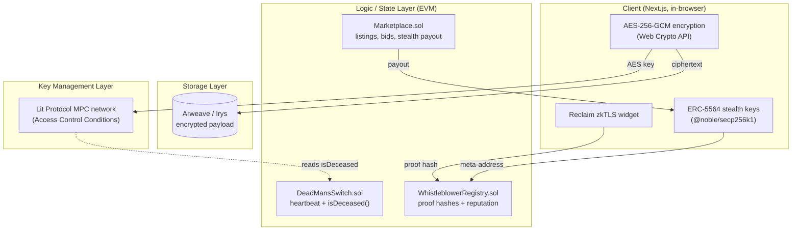

# ZK-Whistle

> A decentralized, censorship-resistant whistleblowing platform built around a cryptographic **Dead Man's Switch**, **zero-knowledge provenance**, and **anonymous payments**.

ZK-Whistle lets a source encrypt sensitive material in the browser, store it permanently on Arweave, and gate its release on an on-chain liveness condition. If the source stops "checking in," a decentralized key-management network releases the decryption key. Sources prove their credibility (employment, account ownership) with zero-knowledge proofs of HTTPS sessions — **without revealing who they are** — and can be rewarded through unlinkable stealth-address payments.

This repository is the implementation accompanying the master's thesis _"Advanced Decentralized Architecture for Confidential Whistleblowing"_ (see [`docs/ZK-Whistle V2 Architecture Update.md`](docs/ZK-Whistle%20V2%20Architecture%20Update.md)). The V2 architecture deliberately replaces the original **TEE (Intel SGX / iExec)** trust anchor with **Multi-Party Computation / Threshold Cryptography (Lit Protocol)** — moving the root of trust from _hardware_ to _math_.

---

## Why this design

| Concern | Original (V1) | This implementation (V2) |
| --- | --- | --- |
| Key custody | Intel SGX enclave (hardware root of trust) | **Lit Protocol MPC/TSS** — key split across a node network, no single holder |
| Failure mode | Side-channel attack / vendor backdoor | Collusion of >2/3 of nodes (cryptographically hard) |
| Trigger logic | Enclave rebuild | On-chain `isDeceased()` read via Lit Access Control Conditions |
| Source credibility | None | **Reclaim Protocol (zkTLS)** zero-knowledge provenance |
| Storage | Server / centralized | **Arweave** permanent, censorship-resistant blobs (via Irys) |
| Rewarding sources | Doxxes the payee | **ERC-5564 stealth addresses** (unlinkable payments) |

---

## Architecture



### The three modules

**Module A — The Vault (Dead Man's Switch)**
A file is encrypted client-side with AES-256-GCM. The ciphertext is uploaded to Arweave; the AES key is encrypted by the Lit network under an Access Control Condition that calls `DeadMansSwitch.isDeceased(user)`. The source calls `checkIn()` periodically. If they miss the interval, `isDeceased()` flips to `true`, and the Lit network will release the key to the recipient (or the public).

**Module B — Identity & Reputation (zkTLS provenance)**
The source uses Reclaim Protocol to generate a zero-knowledge proof of a private HTTPS session (e.g. "active employee", "owns this account") without revealing their identity. The proof's `keccak256` hash is recorded in `WhistleblowerRegistry`, giving journalists a verifiable credibility signal while the full proof stays off-chain.

**Module C — The Marketplace (anonymous exchange)**
Sources list encrypted information; journalists place ETH bids held in escrow. On acceptance, the payout is routed to an **ERC-5564 stealth address** (minus a platform fee), breaking the on-chain link between payer and payee.

---

## Tech stack

| Layer | Technology |
| --- | --- |
| Smart contracts | Solidity `0.8.30`, OpenZeppelin `5.0.2`, Hardhat, `hardhat-deploy` |
| Frontend | Next.js 15 (App Router), React 19, TypeScript |
| Web3 | wagmi 2, viem 2, RainbowKit, Scaffold-ETH 2 hooks |
| Styling | Tailwind CSS 4 + DaisyUI 5 |
| Encryption | Web Crypto API — AES-256-GCM (client-side) |
| Key management | Lit Protocol **v8** (`@lit-protocol/lit-client` + `@lit-protocol/networks` + `@lit-protocol/auth`, Naga network) |
| Permanent storage | Irys → Arweave |
| ZK provenance | Reclaim Protocol (`@reclaimprotocol/js-sdk`, zkTLS) |
| Anonymous payments | ERC-5564 stealth addresses (`@noble/secp256k1`, `@noble/hashes`) |

Project scaffolding is **Scaffold-ETH 2 (Hardhat flavor)**. See [`AGENTS.md`](AGENTS.md) for SE-2 conventions.

---

## Smart contracts

All contracts live in [`packages/hardhat/contracts/`](packages/hardhat/contracts). **No plaintext is ever stored on-chain** — only references (Arweave TX IDs, Lit ACC identifiers, proof hashes) and payment state.

### `DeadMansSwitch.sol`
Heartbeat-based liveness registry.

| Function | Purpose |
| --- | --- |
| `createSwitch(interval, arweaveTxId, litAccessControlId, recipient)` | Register a switch |
| `checkIn()` | Prove liveness, reset the timer |
| `deactivateSwitch()` | Cancel while alive |
| `updateSwitchMetadata(...)` | Re-point storage / ACC references |
| `isDeceased(user)` → `bool` | **Read by Lit ACCs** to authorize release |
| `timeUntilTrigger(user)` → `uint256` | Seconds until trigger (UI countdown) |

### `WhistleblowerRegistry.sol`
On-chain reputation from off-chain zkTLS proofs. `Ownable` — the owner is the
designated verifier (e.g. a backend that validates Reclaim proofs).

| Function | Purpose |
| --- | --- |
| `submitVerifiedProof(Proof)` | **Trustless:** verify a full Reclaim proof on-chain via the configured verifier; marks the proof's `owner` verified |
| `submitProofHash(bytes32)` | Record a Reclaim proof hash (dev/attestation path) |
| `setReclaimVerifier(address)` *(owner)* | Set the deployed Reclaim verifier (enables `submitVerifiedProof`) |
| `setStealthMetaAddress(string)` | Publish an ERC-5564 stealth meta-address |
| `attestVerification(user, bool)` *(owner)* | Authoritatively set verified status |
| `setAutoVerifyOnSubmit(bool)` *(owner)* | Toggle dev-only trust-on-submit verification |
| `isVerified(user)` / `getProofCount(user)` / `getUserProfile(user)` | Reputation reads |

> **Trust model (strongest → weakest).**
> 1. **On-chain verified (trustless):** `submitVerifiedProof(proof)` passes the full
>    Reclaim proof to a deployed Reclaim verifier (`reclaimVerifier`), which checks
>    the witness signatures **on-chain**. Verification accrues to the proof's
>    `owner`, so a valid proof can't be replayed to verify a different account (and
>    it's relay/gasless-friendly). This gives `isVerified` cryptographic meaning
>    with no trusted party. The frontend builds the on-chain `Proof` via the SDK's
>    `transformForOnchain`.
> 2. **Owner attestation:** the `onlyOwner` verifier calls `attestVerification`
>    after validating a proof off-chain — for chains/providers without a deployed
>    verifier.
> 3. **Trust-on-submit (dev only):** `autoVerifyOnSubmit` (constructor flag, default
>    `true` on local Hardhat, `false` on live networks) marks any hash submitter
>    verified. Convenient for demos, **not** a credential check.
>
> The verifier is wired at deploy time: `MockReclaim` on local Hardhat, or the real
> Reclaim verifier via `RECLAIM_VERIFIER_ADDRESS` on live networks.

### `Marketplace.sol`
Escrowed, anonymous information exchange with a 2.5% platform fee (`PLATFORM_FEE_BPS = 250`).
Constructed with the `WhistleblowerRegistry` address so listing verification is
read from the registry, not self-asserted.

| Function | Purpose |
| --- | --- |
| `createListing(descriptionHash, arweaveTxId, minimumBid)` | List encrypted info; `isVerified` is read from the registry for `msg.sender` |
| `placeBid(listingId)` (payable) | Escrow a bid |
| `acceptBid(listingId, bidIndex, stealthAddress)` | Pay out to a stealth address |
| `withdrawBid(listingId, bidIndex)` | Refund an unaccepted bid |

---

## Project structure

```
zk-whistle/
├── docs/
│   └── ZK-Whistle V2 Architecture Update.md   # Thesis architecture report
├── packages/
│   ├── hardhat/
│   │   ├── contracts/                          # DeadMansSwitch, WhistleblowerRegistry, Marketplace,
│   │   │                                       #   IReclaim, mocks/MockReclaim
│   │   ├── deploy/                             # hardhat-deploy scripts (00 mock, 01 registry, 02 marketplace)
│   │   └── test/                               # Contract tests (DeadMansSwitch, Marketplace, Registry)
│   └── nextjs/
│       ├── app/                                # Routes: /, /vault, /identity, /marketplace
│       ├── components/zk-whistle/              # Vault / identity / marketplace UI
│       ├── hooks/zk-whistle/                   # Contract + service hooks
│       ├── services/zk-whistle/                # encryption, litProtocol, irysUpload,
│       │                                       #   stealthAddress, reclaimProtocol
│       └── types/zk-whistle/                   # Shared domain types
```

---

## Getting started

### Prerequisites
- Node.js `>= 20.18.3`
- Yarn (v3, configured via the repo's `packageManager` field)

### Install & run (local chain)

```bash
yarn install

# Terminal 1 — local EVM chain
yarn chain

# Terminal 2 — deploy the three contracts
yarn deploy

# Terminal 3 — frontend at http://localhost:3000
yarn start
```

`yarn deploy` regenerates [`packages/nextjs/contracts/deployedContracts.ts`](packages/nextjs/contracts/deployedContracts.ts) so the frontend stays in sync with the ABIs. On local Hardhat it also deploys a `MockReclaim` and wires it into the registry so the on-chain verification path is exercisable offline.

### Deploy to Base Sepolia (Lit-supported testnet)

The real Lit key-gating / release flow and the real Reclaim verifier only work on a Lit-supported chain. Base Sepolia is wired in [`hardhat.config.ts`](packages/hardhat/hardhat.config.ts) and added to the frontend's `targetNetworks`.

```bash
# 1. Fund a deployer account (one-time)
yarn generate                 # or: yarn account:import
yarn account                  # show address; fund it with Base Sepolia ETH (faucet)

# 2. (optional) enable on-chain Reclaim verification on the testnet:
#    set RECLAIM_VERIFIER_ADDRESS=<deployed Reclaim verifier for Base Sepolia>
#    in packages/hardhat/.env  (see https://docs.reclaimprotocol.org for the address)

# 3. Deploy
yarn deploy --network baseSepolia

# 4. Run the frontend and switch the header network to Base Sepolia
yarn start
```

**Validating the Lit round-trip:** create a vault on Base Sepolia (the wizard seals the AES key with Lit + uploads the manifest to Arweave), let the heartbeat interval elapse without checking in (or use a short interval), then open `/release`, enter the owner address, and decrypt. This exercises the `getDecryptAuthContext` → `decryptKeyFromLit` path against live Naga that local Hardhat cannot.

### Environment variables

Copy [`packages/nextjs/.env.example`](packages/nextjs/.env.example) to `packages/nextjs/.env.local` and fill in:

```bash
NEXT_PUBLIC_ALCHEMY_API_KEY=
NEXT_PUBLIC_WALLET_CONNECT_PROJECT_ID=
NEXT_PUBLIC_RECLAIM_APP_ID=        # from https://dev.reclaimprotocol.org (public)
RECLAIM_APP_SECRET=                # server-only — NOT prefixed with NEXT_PUBLIC_
```

> **Security note:** the Reclaim **app secret** is used **only** in the server route [`app/api/reclaim/route.ts`](packages/nextjs/app/api/reclaim/route.ts) and never ships to the browser. That route initializes the proof request server-side and returns a serialized config; the client rebuilds it with `ReclaimProofRequest.fromJsonString(...)`. The route validates the `providerId` against an allow-list, rate-limits per IP, and returns generic errors.

### Useful commands

```bash
yarn test            # Run contract tests
yarn compile         # Compile contracts
yarn lint            # Lint hardhat + nextjs
yarn next:build      # Production frontend build
yarn deploy --network <network>   # Deploy to a live network (e.g. baseSepolia)
```

---

## Security model & threat mitigations

| Threat | Mitigation |
| --- | --- |
| Plaintext exposure | All encryption is client-side (AES-256-GCM); only ciphertext leaves the browser |
| Single key holder / coercion | Lit Protocol MPC — the AES key is split across the node network |
| Storage censorship | Arweave permanent storage (cannot be unilaterally deleted) |
| Payment de-anonymization | ERC-5564 stealth addresses break the payer↔payee link |
| Fabricated / low-credibility leaks | Reclaim zkTLS proofs give journalists a verifiable provenance signal |

> **Lit network requirement:** Lit Access Control Conditions read contract state from a fixed allow-list of **Lit-supported chains** (Ethereum, Sepolia, Base, Base Sepolia, Polygon, Arbitrum, Optimism, …). The local Hardhat node (chain `31337`) is **not** on that list. The `DeadMansSwitch` must therefore be deployed to a supported network for the trigger to function. The vault wizard detects the active network and:
> - **On a supported chain:** seals the AES key with Lit and uploads the encrypted manifest to Arweave (the real flow).
> - **On an unsupported chain (e.g. local Hardhat):** falls back to a clearly-labeled `local-preview` mode that skips Lit/Irys (no key escrow, no permanent storage) so the create → heartbeat → trigger UX is still demoable locally.
>
> The active Lit network is **Naga** (`naga-dev`) via the v8 SDK. Network mapping lives in [`services/zk-whistle/litProtocol.ts`](packages/nextjs/services/zk-whistle/litProtocol.ts) (`litChainNameFromId`, `LIT_SUPPORTED_CHAINS`).

> **Thesis note — Lit's own trajectory.** Lit SDK v7 (Datil) was sunset on 2026‑02‑25; the v8 "official SDK" path used here keeps the MPC/threshold‑BLS model the thesis argues for (client-side encryption, immutable on-chain conditions, wallet-authenticated decryption). Note that Lit's newer **"Chipotle" (v3)** runtime is **TEE-based** (encryption/decryption inside a Lit Action in a TEE) — i.e. the wider Lit ecosystem is partly re-introducing the hardware trust anchor this project deliberately moved away from. This is worth addressing head-on in the thesis: the V2 design intentionally stays on the MPC (Naga) path rather than the TEE (Chipotle) path.

---

## Current status & known limitations

This is an active research prototype. Honest accounting of what is and isn't wired end-to-end:

- ✅ Three contracts implemented, deployed locally, unit-tested (**76 passing**).
- ✅ Client-side AES-256-GCM, Irys upload, Lit, Reclaim, and stealth-address **services** all implemented.
- ✅ **Vault wizard wired to the real pipeline** — AES encrypt → Lit seals the AES key under the `isDeceased()` ACC → self-describing manifest uploaded to Arweave (Irys) → `createSwitch` stores the real Arweave TX id + `dataToEncryptHash`. Placeholders removed. Falls back to `local-preview` on non-Lit chains (see Lit network requirement).
- ✅ **`Marketplace` reads `isVerified` from the registry** — `createListing` no longer takes a self-asserted flag; the marketplace is constructed with the registry address and queries `registry.isVerified(msg.sender)`.
- ✅ **`WhistleblowerRegistry` hardened** — now `Ownable` with `attestVerification` (owner/verifier path) and an explicit `autoVerifyOnSubmit` dev flag (documented above), instead of unconditional trust-on-submit.
- ✅ **On-chain Reclaim verification wired** — `submitVerifiedProof(Proof)` verifies witness signatures via a deployed Reclaim verifier and marks the proof's `owner` verified (replay-safe). Local dev uses a `MockReclaim`; live networks use `RECLAIM_VERIFIER_ADDRESS`. The identity UI auto-selects the on-chain path when a verifier is configured.
- ✅ **Lit SDK aligned to v8 (Naga)** — migrated off the sunset v7/Datil stack to `@lit-protocol/lit-client` + `networks` + `auth`; network/chain support is centralized and the unsupported-chain case is handled.
- ✅ **Reclaim app secret moved server-side** — proof initialization runs in `app/api/reclaim/route.ts` (allow-listed provider, per-IP rate limit, generic errors); the client only ever sees a serialized request config.
- ⚠️ **On-chain Reclaim verification needs a live verifier** — the path is implemented and tested against a `MockReclaim`, but validating against the **real** deployed Reclaim verifier requires setting `RECLAIM_VERIFIER_ADDRESS` for the target chain and a live proof.
- ⚠️ **Lit decrypt/release flow is not yet wired into any UI** — `decryptKeyFromLit` + `getDecryptAuthContext` follow the documented v8 `AuthManager` pattern but have not been exercised against a live Naga deployment.
- ✅ `DeadMansSwitch` now has a full test suite, and the `Marketplace` carries OpenZeppelin `ReentrancyGuard` on `placeBid`/`acceptBid`/`withdrawBid` (in addition to checks-effects-interactions).
- ⚠️ The `/vault/create` route ships the full Lit v8 client (~2.4 MB first load); consider lazy-loading the Lit service if bundle size matters.

## Roadmap

- [x] Wire the vault wizard to real Irys uploads and Lit key encryption (remove placeholders).
- [x] Read `isVerified` from `WhistleblowerRegistry` inside `Marketplace.createListing`.
- [x] Align Lit SDK package versions (migrated to v8 / Naga); reconcile target network naming.
- [x] Harden the registry trust model (owner attestation + documented `autoVerifyOnSubmit`).
- [x] Move Reclaim secret + proof initialization to a server route.
- [x] Add on-chain Reclaim proof verification (`submitVerifiedProof` + deployed-verifier wiring; tested with `MockReclaim`). _Validate against the real Reclaim verifier on a testnet next._
- [x] Build the release/decrypt UI (`/release`: status lookup → Arweave fetch → Lit `authContext` decrypt → AES decrypt → download). _Live `authContext` validation against Naga still pending a testnet deploy._
- [x] Add `ReentrancyGuard` + a full `DeadMansSwitch` test suite.
- [~] Deploy to a Lit-supported testnet (e.g. Base Sepolia) — config/tooling/docs ready (`hardhat.config.ts` + frontend `targetNetworks` + deploy guide above); the broadcast needs a funded deployer key. Validate the end-to-end Lit release after deploying.
- [ ] Future work from the thesis: duress "kill switch", ZK-Email provenance, gasless `checkIn()` via relayer, cross-chain triggers.

---

## License

MIT — see SPDX headers in the contract sources.
